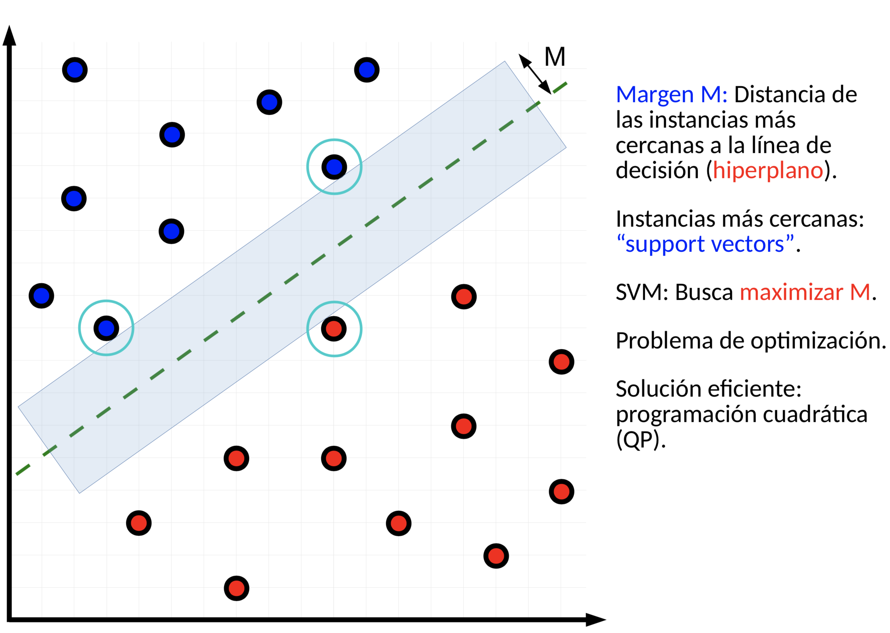
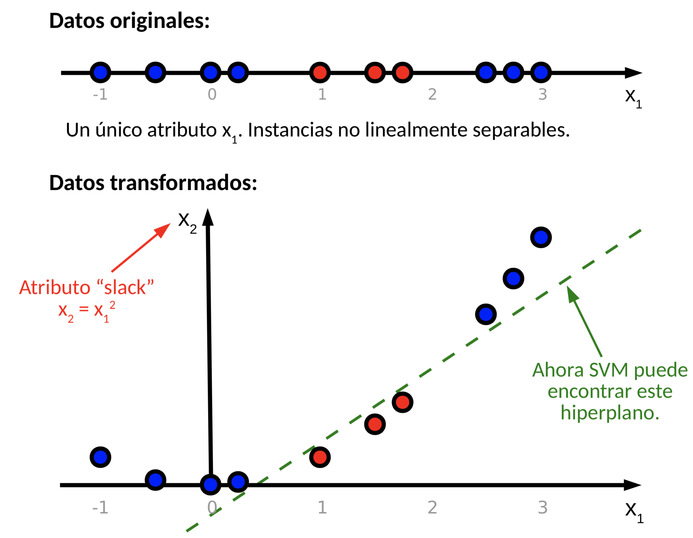
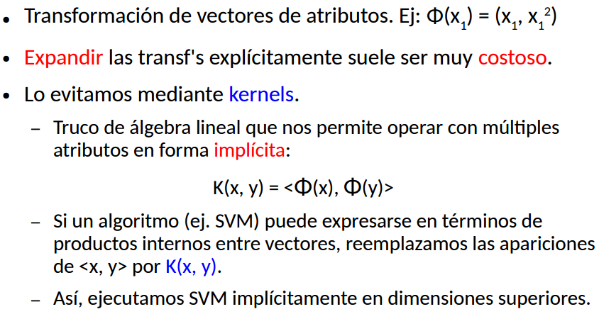

# Algoritmos

Queremos aproximar un concepto, una función objetivo de manera automatica. Ejemplo de funcion de objetivo de tenis:

Tenis: Cielo x Temperatura x Humedad x Viento -> {Si, No}

Tenemos un conjunto de hipotesis. Este conjunto de hipotesis son funciones parecidas a la F (nuestra funcion objetivo). Depende del algoritmo de aprendizaje.

Que es el algoritmo de aprendizaje? Una entrada posible es un conjunto de instancias y sus clasificaciones. La salida del algoritmo es una h que mejor aproxime.

## Arboles de decision:

Lo que tenemos es una F que va de los atributos a la clase, cada nodo interno evalua un atributo discreto, cada rama corresponde para un valor de ese atributo y cada hoja es una clase.

**Induccion Top-Down de Arboles de decision:**

1. A ← el “mejor” atributo para nodo_actual.
2. Asignar A como atributo de decisión del nodo_actual.
3. Para cada valor de A, crear un nuevo hijo del nodo_actual.
4. Clasificar (repartir) las instancias en los nuevos nodos (según el valor de A).
5. Si las instancias están clasificadas perfectamente: FIN. Si no: iterar sobre los nuevos nodos.

La entropia mide cuan sucia, dispersa, heterogenea esta la informacion. Agarramos algunas instancias de alguna poblacion (una muestra) y vamos a ver la entropia de esa muestra con respecto de una variable objetivo Y.

Si son todos de river, tenemos entropia 0, al igual que si tenemos ninguno de river. La entropía es máxima cuando tenemos la muestra totalmente bien desprolija. La mitad de cada uno, representantes de todas las clases por igual.

La idea es reducir la entropia lo mas que podamos. Elijo un atributo y parto la muestra en sub muestras. Ahi veo si la entropía de la cual partia es menor a la suma ponderada de las entropias resultantes. Buscamos el atributo que mas nos disminuya la entropia. Entonces en cada nodo elegimos el atributo con mayor ganancia de informacion (el mas informativo).

**Espacio de hipotesis:**
Espacio completo de funciones de valores discretos. En principio puede construirse cualquier arbol. Puede modelar el espacio de funciones de valores discretos.

**Sesgo inductivo (como funciona el algoritmo):**
Partiendo de arboles simples, los vamos complejizando agregandole nuevos niveles de profundidad (construccion de arboles cada vez mas complejos).

**Metodo:**
Hill-climbing sin backtracking (converge a max. local).

**Atributos mas informativos -> cerca de la raiz (no tiene porque ser bueno esto)**

**Atributos Numéricos**

- ¿Qué pasa si tenemos un atributo numérico A?
  Buscamos un umbral c, para discriminar según A<c.

- ¿Cómo elegir c?

1. Ordenar las instancias según A.
2. Buscar la forma de partir la lista que maximice la ganancia de información.

- ¿Cuán robustos son los Árboles de Decisión ante atributos faltantes?
  Una solucion podria ser rellenar esos campos que faltan con la media.

- Y si tenemos instancias de entrenamiento con valores indefinidos en algunos atributos, Ej.: datos clínicos de un paciente incompletos o poseemos datos ruidosos?
  El algoritmo lo que hace es estadistica, agarra muestras y dice, la mayoria pasa esto. Podemos usar la media, mediana, etc, que poseen robustez ante outliers. Es un algoritmo basado en estadística sobre muestras por lo que es relativamente robusto ante datos ruidosos.

- Y si ahora tenemos instancias de entrenamiento mal clasificadas, como por ejemplo errores cometidos en las anotaciones manuales?
  Llegamos a un atributo y vemos que no esta clasificado. Que hacemos? Puedo elegir el mas probable de las dos ramas.

A medida que el arbol es mas profundo, voy mejorando la descripcion de los datos de entrenamiento. Cuando empiezo con el arbol vacio, no describo nada. Si es muy profundo seria como un if gigante. Medir exactitud sobre datos de entrenamiento es una mala idea.

Una definicion un poco mas formal de **sobre-ajuste** seria:

Dado el error sobre un conjunto de entrenamiento y el conjunto de todas las instancias posibles, h se sobreajusta a los datos de entrenamiento si existe h’ tal que:

error_entrenamiento(h) < error_entrenamiento(h’) y error_todo(h) > error_todo(h’)

Es decir H efectivamente funciona mejor sobre los datos de entrenamiento pero no para todas las instancias posibles. H prometia un monton pero en la vida real falla. Se ajusto demasiado. Lo que quiere decir es que probablemente siempre caigas en algo de sobreajuste pero hay que tratar de modelarlo. Un threshold de cuanto sobreajuste me banco.

PONER GRAFICO DE SOBREAJUSTE DE ARBOLES

## Soluciones:

- **Criterio de parada**
  No construir más allá de cierta profundidad.

- **Pruning (poda)**
  Construir el árbol entero; podar las ramas cuando ello mejore la exactitud sobre datos separados. Voy rama por rama viendo si cortando por ahi y testeo sobre datos separados, mejora o no la performance (accuracy en este caso). Osea al set de entrenamiento lo parto en un set de testeo (ojo que entreno con todo el set de datos). Cual es el umbral para cortar o no cortar es parte del sesgo inductivo.

- **Rule post-pruning**
  Construir el árbol entero; convertir árbol a reglas; sacar precondiciones de las reglas cuando ello mejore su exactitud sobre datos separados; reordenar las reglas segun exactitud. Crea un arbol entero, lo convierte a reglas (como son las reglas? Si decia si cielo es igual a sol y humedad es igual a alta entonces no juegues). Sacamos condiciones de las reglas. Las reglas son todas conjunciones de precondiciones. Vamos a ir volando de a una precondicion a la vez y ver si mejora sobre los datos separados. Como ir sacando precondiciones, de izquierda a derecha o al revez, todo eso es parte del sesgo inductivo.

## Naive Bayes:

Espacio de hipótesis:
Sesgo inductivo:

## KNN:

### Espacio de hipótesis:

Los espacios de voronoi. Y algo sumamente fuerte es que puntos que estan cerca deberian ir a la misma clase.

### Sesgo inductivo:

### Distance-Weighted KNN:

Que pasa con la distancia? Se calcula sobre todos los atributos, y si algunos son irrelevantes? Si tenemos mucho ruido hay que ver como definir la distancia.

## SVM:

Busca un hiperplano de margen maximo que separe nuestras clases.

Ahora, que sucede si nuestras clases no son linealmente separables?

### Kernel Trick:

### Espacio de hipótesis:

Fijamos un kernel de grado 3. Todos los posibles hiperplanos en ese espacio superior que me permiten separar las clases. La forma de elegir una hipotesis es maximizando el margen.

### Sesgo inductivo:

Fijar un kernel y maximizar el margen de separacion de un hiperplano entre las clases.

### Sesgo y varianza:

## Conjunto de clasificadores:

**Entrenar un modelo, permitir el sobreajuste:**

- Por ejemplo: árboles muy profundos.
- Bajo sesgo; alta varianza.

**Entrenar varios modelos, c/u sobre datos distintos.**

- Cada modelo sobreajusta de manera diferente.

**Cada modelo: bajo sesgo, alta varianza.**

- Votación: Para una nueva instancia, devolver la clase más elegida.

**Esta votación reduce la varianza de la clasificación. ¡Magia!**

**Si los modelos individuales devuelven probabilidades, se puede hacer una votación ponderada.**

**En regresión, se puede devolver el promedio de los valores devueltos por los modelos individuales.**

**Problema de bagging con árboles:**

- Si pocos atributos son predictores fuertes, todos los árboles se van a parecer entre sí.
- Esos atributos terminarán cerca de la raíz, para todos los conjuntos generados con bootstrap.

## Random Forest:

- Igual a bagging, pero en cada nodo, considerar sólo un subconjunto de atributos elegidos al azar.

### Boosting

- Comenzar con un modelo (simple) entrenado sobre todos los datos: $h\_{0}$
- En cada iteración i, entrenar $h\_{i}$ dando (gradualmente) mayor importancia a los datos mal clasificados por las iteraciones anteriores.
- Terminar al conseguir cierto cubrimiento, o luego de un número de iteraciones.
- Clasificar nuevas instancias usando una votación ponderada (p.ej.) de todos los clasificadores construidos.

### Stacking

- Entrenar diferentes modelos (modelos base) y un modelo más, que decide, dada una instancia nueva, qué modelo usar.
