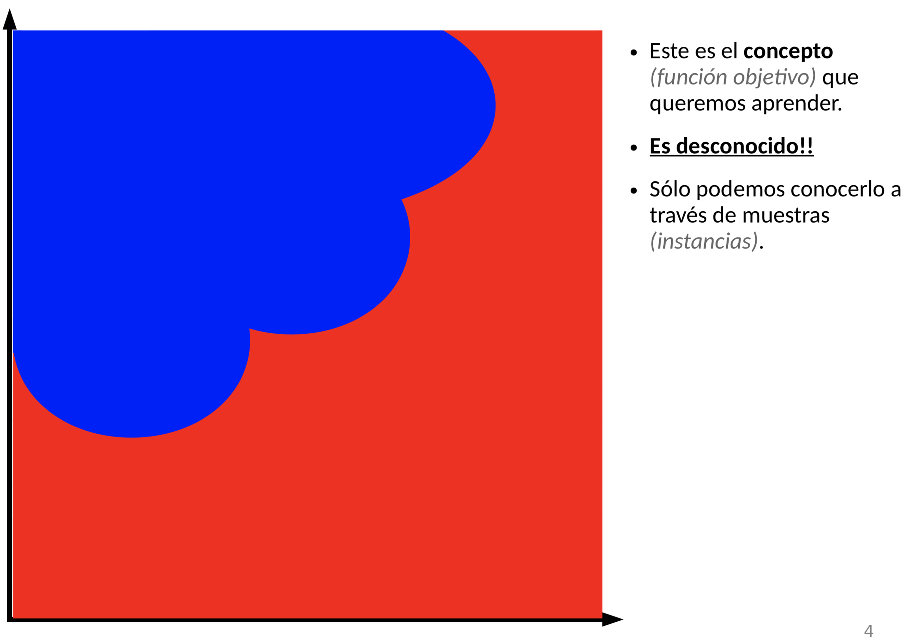
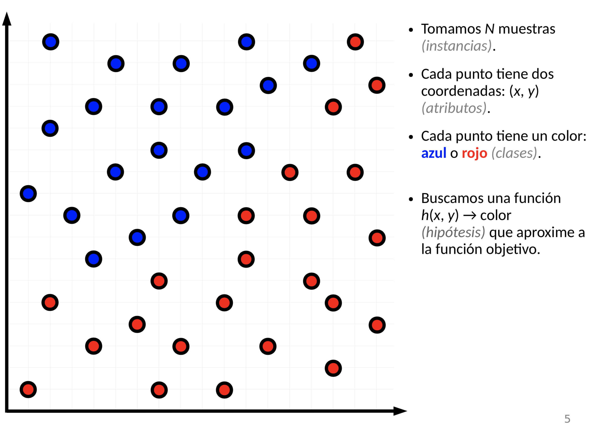
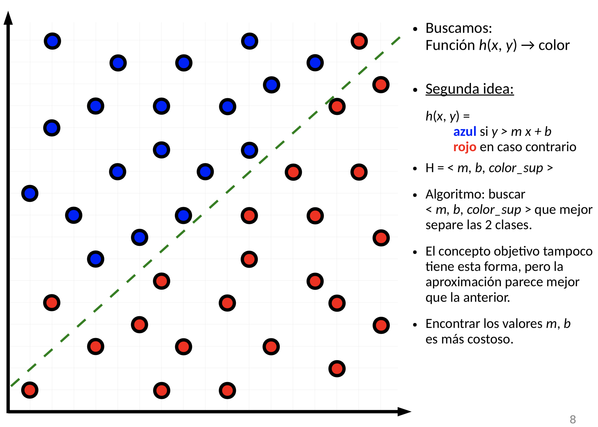
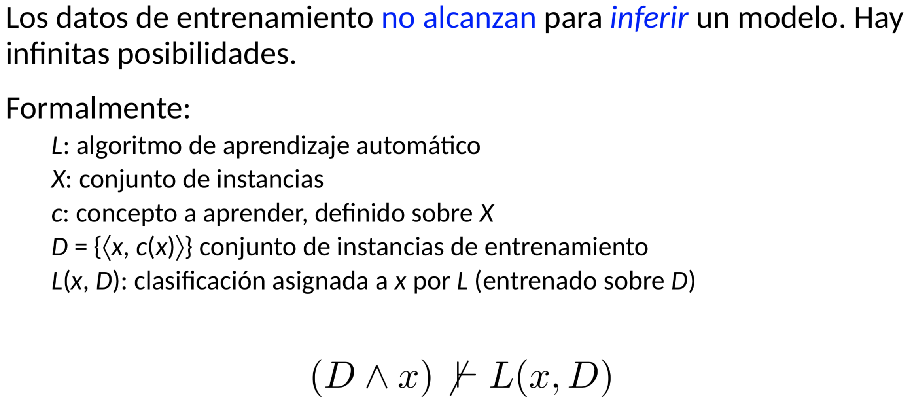
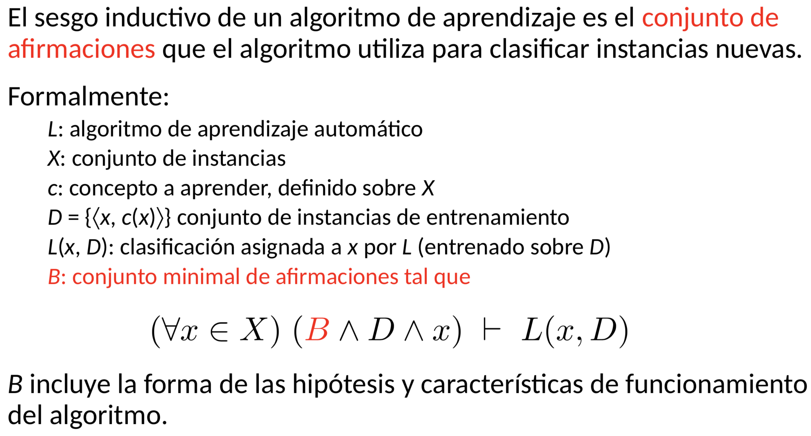
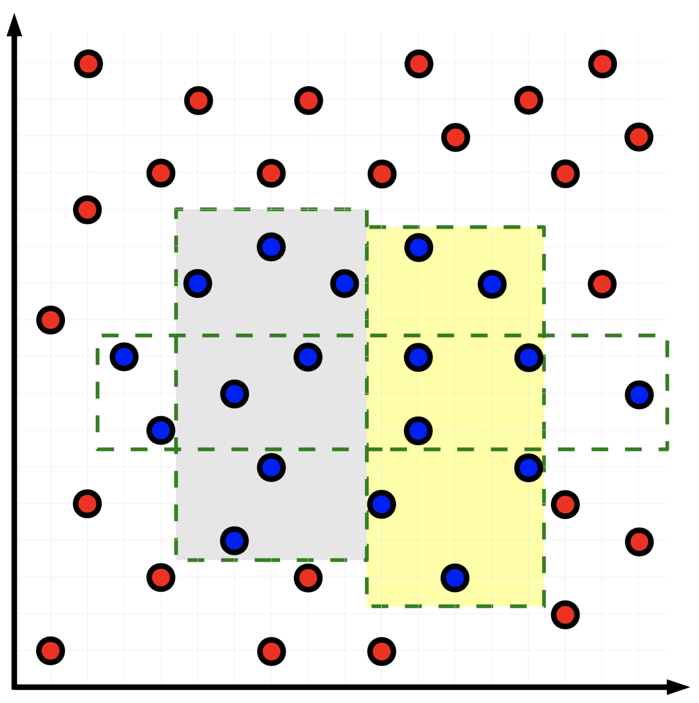
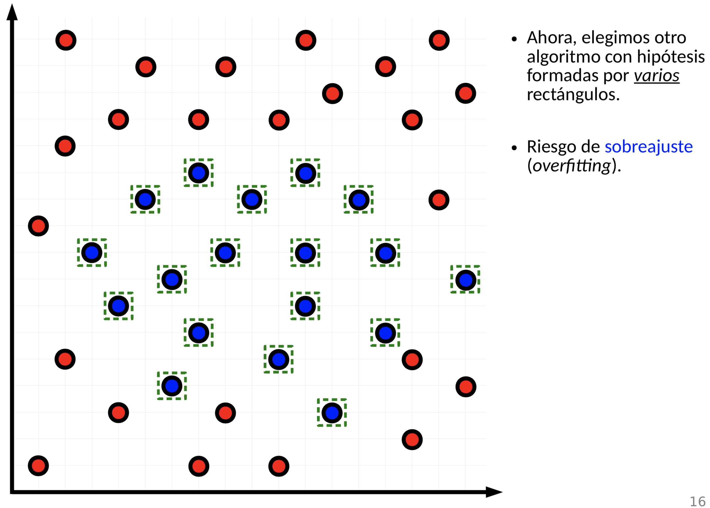

# Aprendizaje de conceptos:

Tenemos que empezar a aprender conceptos. Por ejemplo aprender a diferenciar aves. Puedo pensar que si tiene plumas y un pico es un ave. Estas son mis hipotesis de que es un ave. Aprender un concepto es inducir una funcion booleana a partir de ejemplos de entrenamiento. Aprender que es un ave es poder decir, esto es o no es un ave. Los ejemplos de entrenamiento son, cada vez que veo algo y le pregunto a algun adulto, esto es un ave? Ahi aprendo. Lo que hacemos es construir y evaluar hipotesis. Tiene varios significados una hipotesis: una suposicion que uno hace en algun contexto y un modelo. El modelo de ave. Son las reglas que me permiten clasificar nuevos objetos. Ese modelo me ayuda a predecir nuevas cosas. A ese modelo en ML se le llaman hipotesis. Una hipotesis aca es, que supones vos que es un ave. Cual es tu modelo de ave. Empezamos con vuela, falla, vuela y tiene pico, falla y asi la voy mejorando. Tenemos un espacio de hipotesis, que son todas las hipotesis que existen que me definen ave. Todas las posibles definiciones de ave. Puede ser que todas las posibles formas en que yo puedo modelar el concepto de ave no contengan a la verdadera nocion de ave. Que no tenga los atributos necesarios o que simplemente no sea expresable en este lenguaje. Por ejemplo, con las aves usabamos la logica proposicional. Puedo probar un monton de espacios de hipotesis distintos y que ninguno contenga la definicion exacta de ave (nuestro concepto objetivo). Nos basta conformarnos con una aproximacion a dicho concepto objetivo. Entonces un algoritmo de aprendizaje que hace? Busca en el universo de hipotesis, aquella hipotesis que mejor se ajuste a los datos de entrenamiento. Busco la hipotesis que tenga la mayor probabilidad dado un set de entrenamiento (la que predice mejor sobre ejemplos no vistos por nuestro algoritmo).
Encontrar una hipotesis que, dado los datos de entrenamiento, tiene maxima probabilidad. Es la maxima probabilidad a posteriori.

Pensemos que ahora volvemos a los puntos en el plano.

Quiero aprender ese concepto. Es un concepto que no esta escrito en ningun lado. La unica forma que tengo de llegar a eso es a traves de algunas muestras clasificadas. Tengo una cantidad finita de instancias de entrenamiento. Nuestra H es una funcion que vaya de X a Y. Queremos aproximar la funcion objetivo. Nuestra funcion objetivo es el concepto que queremos aprender.

Lo que estamos haciendo aca es aprendizaje inductivo. La induccion no es un proceso logico de por si. Un proceso logico es algo como: "socrates es hombre, todos los hombres son mortales, ergo socrates es mortal". Es un razonamiento, una inferencia logica. La induccion es otra cosa. Tenemos una muestra especifica, y a partir de eso construir un modelo general. No tenemos una unica manera de hacerlo. A veces falta muchisima informacion. Como a partir de los datos voy a poder reconstruir el modelo objetivo. Tenemos un salto entre ambas cosas. Supongo que a partir de los datos puedo construir algo que tenga sentido. Tenemos la asuncion de aprendizaje inductivo: cualquier hipotesis que aproxime bien a una funcion objetivo sobre un conjunto sufiicentemente grande de instancias de entrenamiento tambien aproximara bien a la funcion objetivo sobre nuevas instancias. Sobre instancias no observadas. Voy a suponer que eso me va a servir para nuevas instancias. Es la piedra fundamental del aprendizaje automatico. Es un punto de partida. Tengo que confiar en que eso funciona. Estamos diciendo que los datos tienen cierta estructura. El salto inductivo es el hecho de que no me alcanza con lo que observo para generar el modelo objetivo. Si yo pudiera hacer ese salto de lo especifico a lo general de manera directa no existiria el area de ML. Seria puramente logica.

Entonces empezamos a probar hipotesis. En el ejemplo de los puntos en el plano, tiramos una recta para separar los datos. Permitimos que nuestros modelos sean los separables por una recta. Buscamos la recta que menos le pifie. Tenemos que ajustar la constante (a, b). El conjunto de hipotesis es el par ordenado.

Entonces ajustar ese modelo a estos datos, es buscar el par (a, b) correcto. El espacio de hipotesis son todas las combinaciones posibles de (a, b). Entrenar un modelo que pertenece a este espacio de hipotesis en este caso simplemente es buscar la mejor recta. Eso es ajustar una hipotesis a los datos. Buscar la hipotesis que maximiza la performance para esos datos. A medida que agrego mas parametros, mi espacio de hipotesis es cada vez mas grande. Van a haber muchos conceptos que no pertenezcan al espacio de hipotesis de las rectas. Va a ser menos expresivo nuestro espacio de hipotesis.

Los datos de entrenamiento no sirven para deducir formalmente el modelo.

Tenemos nuestro algoritmo y un conjunto de instancias. Todo conjunto de instancias posibles. C es el concepto a aprender. D es el conjunto de instancias de aprendizaje (instancias con sus clases). Y por ultimo tenemos la clasificacion que L va a asignar a una instancia nueva dado los datos de entrenamiento.

Dado una nueva instancia, no puedo inferir logicamente cual es la clasificacion dados los datos de entrenamiento. L es un algoritmo entrenado con los datos de entrenamiento. No hay una forma algoritmica de llegar de un lado al otro. Necesitamos algo mas.

Ahora si puedo razonar, inferir la clasificacion correcta de la nueva muestra. B es el conjunto minimal de afirmaciones necesarias para que esto sea asi (un proceso algoritmico). Es el sesgo inductivo. El sesgo inductivo de un algoritmo L cualquiera es un conjunto de afirmaciones necesarias para poder clasificar instancias del modelo de manera deterministica. Cada algoritmo que vamos a ver va a tener un conjunto de afirmaciones, va a decir por ejemplo, las hipotesis tienen esta forma y voy a usar estos atributos, y dados todas estas afirmaciones esto va a ser una inferencia. Si lo que vamos a hacer es construir arboles de decision, con determinado algoritmo, con determinada forma de ir agregando nodos al arbol, determinada forma de elegir los atributos, bueno, esa forma, esos algoritmos de construir las hipotesis son el conjunto de afirmaciones que hacen que yo le de datos, entreno el algoritmo y me pueda clasificar instancias no observadas (de manera deterministica). Por ejemplo, en el modelo que separabamos con rectas, un conjunto de afirmaciones podria ser que todas las rectas son rectas verticales. Lo unico que puedo hacer es poner rectas verticales. Lo que hace el algoritmo es decirme donde colocar la recta vertical de manera que me separe mejor las clases. Donde minimizas el error de los datos de entremaiento. Otro sesgo inductivo puede ser que son rectas, otro que son parabolas. Una vez que uno define que las hipotesis tienen forma de recta o parabolas, ya esta definiendo deterministicamente el procedimiento de inferencia. La induccion esta determinada cuando uno fija el sesgo inductivo.

Otro tipo de modelos puede ser, pongo cajas. Ajusto el alto, ancho y posicion de la caja. El algoritmo me busca la mejor hipotesis. Si un cuadrado esta bueno, entonces metamos mas de uno. Pongamos muchos. Si tenemos varios rectangulos podemos atrapar mejor las clases. Tengo una nueva explosion en mi espacio de hipotesis que es tomar la decision de cuantos rectangulos usar.

En el peor caso, cada punto de una clase esta encerrado en una cajita. Esto no generaliza nada. Esta mega overfiteado.

La intuicion que tenemos de que eso no generaliza se denomina la navaja de occam. Hay que buscar la explicacion mas simple. No hay que ir a cosas complejas si no es necesario. Ambas son igual de buenas clasificando los datos de entrenamiento pero la primera es muchisimo mas simple. Estamos acostumbrados a hacer esto en la vida real. Es un principio, una suposicion. Hay casos en los cuales esto falla. No siempre el modelo mas simple es el mejor, pero es una buena heuristica. Por ejemplo cuando tenemos varias hipotesis equivalentes, el algoritmo desempata agarrando la mas simple.

Clave: encontrar la mejor hipotesis que maximice cierta funcion objetivo.

$H\_{MAP}$: hipotesis maxima a posteriori.

Entonces, **que es machine learning?** Es dado los datos de entrenamiento, buscar en mi espacio de hipotesis aquella que maximiza la probabilidad. Esa hipotesis es la hipotesis maximza a posteriori.

**Probabilildad a priori:**
Es una probabilidad que no depende de los datos. Aca podemos entre otras cosas meter el hecho de que queremos soluciones mas simples, dandole probabilidades muy bajas a aquellas hipotesis que sean complicadas. Pocos rectangulos va a ser mas probable a priori que muchos rectangulos. La **verosimilitud** es, supongamos la hipotesis que estoy viendo ahora es cierta, cual es la probabilidad de que los datos hayan salido de ese mundo en el cual la hipotesis es cierta. Cuan compatible son los datos de entrenamiento suponiendo que esta hipotesis es cierta. Si ponia en el ejemplo de la recta, la recta vertical muy a la izquierda, los datos eran muy inverosimiles dado ese concepto, dada esa hipotesis. Cuando todas las hipotesis son equiprobables, hablamos de encontrar la hipotesis de maxima verosimilitud.
