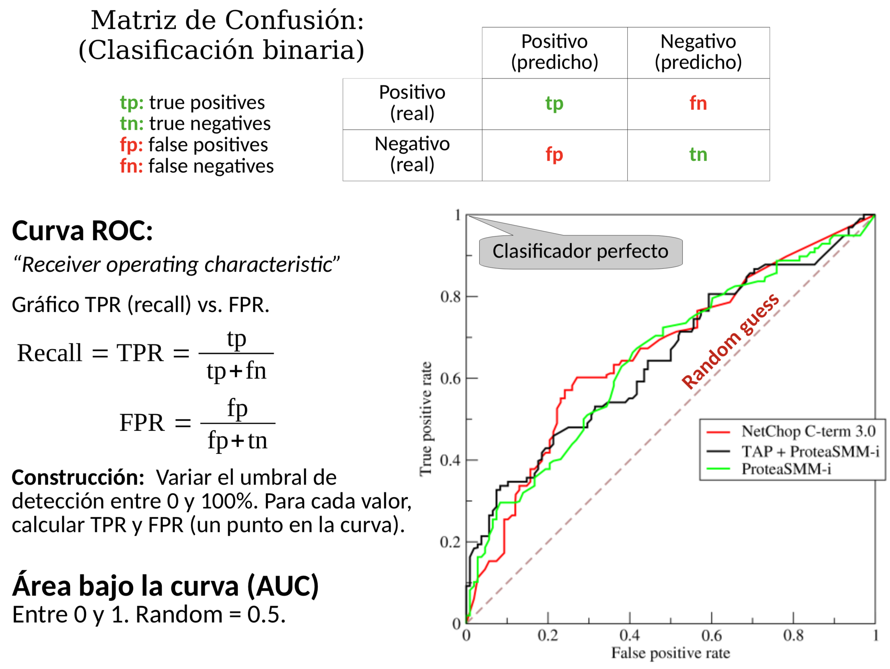

# Metricas

## Evaluacion de hipotesis:

Como hacemos para saber que tan buena es una hipotesis? Podemos comparar nuestra hipotesis con el concepto? No porque no tenemos una comparacion directa. No podemos saber directamente si aprendimos bien o mal. La idea es ver cuan buena es una hipotesis.

## Medidas de performance:

**Un modelo tiene una exactitud (accuracy) del 95%.**

- O sea, de cada 100 instancias, clasifica bien 95.

**¿Qué significa esto?**

- Según la tarea y la distribución de clases en el dominio, 95% puede ser muy bueno o pésimo.
- No dice nada sobre el tipo de aciertos y errores que comete el modelo.

**Ejemplos:**

- **Filtro de spam**:
  Descarta directamente los mails sospechosos. Imaginense que el filtro agarra los mail que clasifico como spam y los elimina. Pensemos cuando le pifiamos. Un mail genuino podemos marcarlo como spam y tirarlo y a un mail como spam podemos considerarlo que no es spam. Cual de los dos errores es mas terrible? Claramente el primero. Es un error mucho mas grave. El balance de errores es bastante disparejo. El accuracy no me dice nada de que tipo de error estoy generando.

- **Detección de fraude**:
  Prepara un listado de casos sospechosos para ser revisados por humanos. Aca que conviene? Dejar pasar un acto fraudulento o manejar como sospechoso un caso en el que no paso nada? Mejor dejar pasar y que lo vea un ser humano. A la inversa que con el spam.

- **Identificación de meteoritos**:
  Agarro una piedra por el camino y me pregunto si es un meteorito. El algoritmo dice (Start -> no es un meteorito). Esto si usamos un set de entrenamiento de las piedras en la tierra va a tener un accuracy del 99.999%. Sirve para algo esta metrica en este caso? No.

Hay que encontrar una manera de ponderar los tipos de errores.

PEGAR DIBUJITO DE MATRIZ DE CONFUSION Y TODAS LAS FORMULAS

## Accuracy:

Porcentaje de datos de entrenamiento clasificados correctamente.

## Precision:

De todos los que dijimos “si son positivos”, cuantas veces eso estuvo bien. Que porcentaje de veces dijimos bien.

## Recall:

De todos los casos de spam reales vamos a ver cuantos efectivamente los mostramos como spam.

## F-measure:

Combina ambas metricas. Tambien conocida como $F*{1}$ Measure. Se generaliza a la $F*{\beta}$. Podemos jugar con ese $\beta$ para enfatizar recall ($\beta$ = 2) o precision ($\beta$ = 0.5). Si gano de uno, pierdo del otro.

PONER DIBUJITO DE CURVAS PRECISION \* RECALL

**Documento recuperado** = positivo predicho (ej: mail clasificado como spam por el modelo)
**Documento relevante** = positivo real (ej: mail anotado como spam por el usuario.)

**Precision** son de los documentos recuperados, que porcentaje son relevantes.
**Recall** son de los documentos relevantes, que porcentaje fueron recuperados.

**Filtro de spam:** si priorizamos recall estariamos diciendo que de todos los spam que estan ahi quiero descartar la maxima cantidad. Puedo maximizar el recall tirando absolutamente todo. Todo digo que es spam y lo elimino. Tengo que maximizar la precision.
Deteccion de fraude: quiero priorizar el recall. Quiero descartar la mayor cantidad de actividades fraudulentas, pero si una fraudulenta pifie y dije que no era, luego la revisa un humano y se da cuenta que es fraudulenta.

## Curva ROC:

**TPR:** de todos los positivos, a que proporcion pudimos marcar.
**FPR:** de todos los negativos, a cuantos le pifiamos

El clasificador perfecto tiene TPR = 1 osea le pega siempre y no tiene ningun falso negativo, no se le escapa ninguno.
Como construir la curva? Vamos a variar el umbral de deteccion entre 0 y 100%. Para cada valor corro mi algoritmo de clasificacion que me devuelve no una clase sino un porcentaje de pertenencia a la clase positiva, entonces para cada una de estas voy a decidir bajo un umbral decidir si le doy bola o no a decir que es positiva la instancia y pongo un puntito. Cada curva se puede condensar en un numero, el area bajo la curva. Esto nos permite comparar varios clasificadores. Si necesitamos tener un numero para decidir que algoritmo elegir, esto es muy util.
