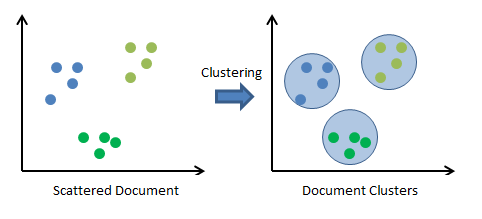
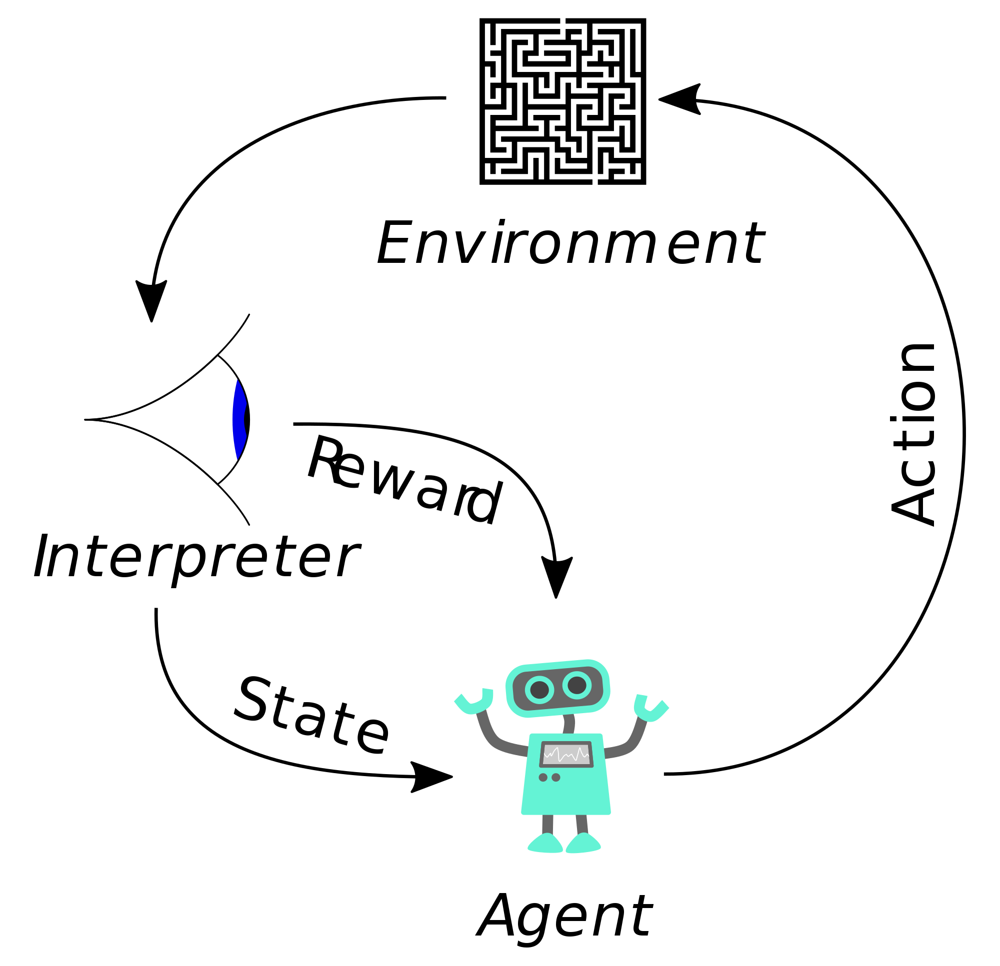

# Paradigmas dentro de aprendizaje automatico:

- ### Aprendizaje supervisado:
  Le doy como experiencia un conjunto de datos con su correspondiente clasificación para entrenar nuestro algoritmo. Estamos supervisando, ayudando al algoritmo. Dentro de este paradigma tenemos dos grandes tipos de algoritmos: por un lado estan los denominados de clasificacion (dado un mensaje, clasificarlo en SPAM o HAM), y por el otro los de regresion (cada instancia tiene un valor numerico, por ejemplo dado un mail tenemos una probabilidad de que sea SPAM o HAM). La clasificacion aprende una etiqueta mientras que la regresión aprende un numero.
  Algo importante en este tipo de aprendizaje es elegir atributos. De todos los atributos que decidimos extraer, nos tenemos que quedar con los mejores (para esto se pueden usar tecnicas de reduccion de la dimensionalidad por ejemplo, a esta etapa se la denomina Feature Selection). Luego de extraer atributos y entrenar nuestro algoritmo, tenemos que evaluarlo con un set de datos que no hayamos usado para entrenamiento. Es decir, un set de datos de Test que nos permita verificar efectivamente si nuestro algoritmo generaliza bien o esta muy apegado a los datos. Es decir, si estamos "Overfiteando" a los datos de entrenamiento.
  
- ### Aprendizaje no supervisado:
  En este caso tenemos solamente los datos sin ningun tipo de clasificacion. Esto esta muy de moda con big data. Tenemos toneladas de informacion por segundo, y no tenemos ni idea que hacer con eso. Los tratamos de agrupar en conjuntos de semejanza. Por ejemplo con Clustering podemos, bajo una metrica establecida, agrupar los datos en clusters (i.e los datos similares bajo dicha metrica van a estar "pegados los unos a los otros").
  
  
- ### Aprendizaje por refuerzos:
  Es un aprendizaje gradual. Por ejemplo aprender a jugar al pacman, tengo un conjunto de estados y voy aprendiendo a medida que voy jugando. Paso de un estado a otro. Si estaba en un estado y paso a otro pero me come un fantasmita, aprendo que no tengo que ir por ese lugar. Tengo un conjunto de acciones y estados en este caso. A destacar es que en aprendizaje por refuerzos interactuamos con el medio. Otro ejemplo son los asensores. Por ejemplo un asensor puede ir aprendiendo sobre la marcha como optimizar el tiempo de espera. Cuando el asensor esta sin hacer nada puede decidir si dejar la puerta abierta o cerrada. Puede decidir quedarse en ese piso o moverse a otro, mejorando el tiempo de espera. A lo largo de todo el dia el tiempo que le lleva a una persona desde que aprieta un boton para llamar al asensor hasta que sale de este, esa suma de tiempo sea minima. Por ejemplo, en cierto edificio conviene que el asensor a las 3 de la tarde este parado en el 5to piso.
  
