# Aprendizaje por refuerzos:

Perro de pavlov. Le daba carne y veia que salivaba. Siguiente experimento dijo, si el perro saliva al ver la carne, hay una consecuencia de ver la carne, que pasa si yo cada vez que le doy de comer toco la campanita? Asi lo hizo sobre cierto periodo de entrenamiento y despues ve que al tocar la campanita, el perro saliva sin que este la carne. El tipo lo que hizo fue hacer que dos estimulos separados que no tengan nada que ver, asociarlos para que despues cuando toque la campanita genere el efecto del otro evento asociado. Condicionamiento pavloviano.

Con el tiempo siguieron haciendo este tipo de experimentos. Ponen a una rata que tiene un auricular. Cuando suena ven cuanto se congela, se queda quieta paralizada. En la etapa de habituacion al principio hay un pequeño porcentaje de ratas que al sonido se quedan paralizadas. El sonido en si no hace nada, no tiene ningun efecto. Ahora ademas de dar sonido, se los electrocuta un poquito. Rapidamente la rata aprende que cuando viene el tono se viene la electricidad. Van entendiendo que tono significa todo mal. Despues viene la etama de extincion que solo se reproduce el tono. Se ve que al principio de esta etapa cuando suena el tono se paraliza pensando que la van a electrocutar. A lo largo del tiempo esto baja y desaprende. Vuelve a entender que no pasa nada con el sonido.

El cerebro de estos seres es plastico y se pueden ir adaptando dependiendo del entorno. Esta todo el tiempo aprendiendo y reaccoinando ante el entorno.

Aca no hay ningun tipo de toma de decisiones. Hay relaciones estimulo-respuesta sin ningun tipo de control. Vamos a querer agregar el control para tomar decisiones. Tomar una accion y tener algun tipo de respuesta. Tienen consecuencias las acciones.

Thorndike hizo un experimento con gatos y creo lo que se llama ¨curva de aprendizaje¨. Agarro gatos y los puso adentro de una jaula. Gatos con hambre. Estas cajas tenian que hacer ciertas cosas, como meter la manito y levantar algo, etc. Alguna estrategia habia que aplicar para salir de la caja. En los primeros intentos se ve que tardaban bastante tiempo en segundos. El gato se va capacitando. En las primeras etapas aprende como salir de la caja. El gato toma decisiones y fue aprendiendo a salir lo antes posible de ahi. En la vez numero 30 ya sabe como es la estrategia para salir. Aca vemos que los animales pueden aprender comportamientos arbitrarios.

Modelo de aprendizaje guiado por errores: el cambio en el valor de una asociacion es proporcional a la diferencia entre nuestra prediccion y lo observado

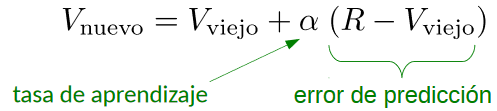

R es el valor de una asociacion entre dos cosas, salivar y ver un churrasco, hacer la estrategia y salir de la jaula, etc. Al valor nuevo va a ser lo que yo sabia antes mas un learning rate y un error. Este error es el valor riesgo y el valor viejo. El valor riesgo es lo que vamos a llamar recompensa.

La forma que aprendemos no es inmediata, lleva tiempo.

Aprendizaje por refuerzos. Tenemos un agente (por ejemplo un robot), que tiene sensores para observar el estado de su entorno. La definicion de estado la damos nosotros, por ejemplo, todo lo que ocurre a nuestro alrededor. Vamos a tener acciones, cada accion que haga probablemente va a modificar el estado. Cada accion conlleva a una recompensa inmediata (cero, positiva o negativa). Estos son los elementos que necesitamos para hablar de aprendizaje por refuerzos.

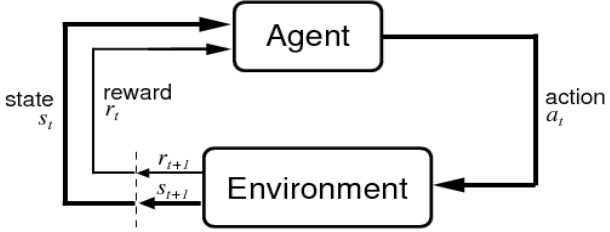

Es un loop infinito, va a ir todo el tiempo ciclando.
El objetivo es que el agente aprenda una estrategia o politica de control para elegir las acciones que maximicen las recompensas. Que se desempeñe de manera inteligente. Pi es una politica que es una funcion que dado un estado elige una accion.

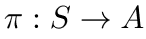

SI yo tengo un estado, tomo un accion y gano una recompensa tiene mucha pinta a una regresion, o clasificacion. En si a algo supervisado. Estoy tomando decisiones y despues me dicen si estuvo bien o mal. Para dejar en claro que esto no es aprendizaje supervisado vamos a ver las diferencias:

Las recompensas vienen o pueden venir con demora, es decir, por ejemplo ganar un juego de ajedrez quiza uno pueda ver internamente las mejoras localmente pero asi no funciona este paradigma, la recompensa viene al final de todo cuando ganaste el juego y ahi tenes que poder ser capaz de recompensar las acciones anteriores, darle distintos pesos en funcion de haber ganado. Entonces esa nocion de ver a cada decision como un problema de clasificacion se pierde, porque la clasificacion tendria que tener ya la recompensa. No existe esa nocion de planificar. Otra cosa importante es que en el caso del robot que va por ahi aprendiendo, los datos de entrenamiento los determina el robot mismo. Si al robot se le canta explorar por aca y se choca con una pared, esas decisiones, esos datos de entrenamiento son basados en la propia estrategia del robot.

El formalismo estandar para modelar a estos agentes se conoce como un proceso de decision de Markov. Tenemos un conjunto de estados S (lo que observa el robot o el agente). No necesariamente es facil de definir. Cuando es muy dificil definir que es un estado, se usan redes neuronales para facilitarlo. La definicion de S puede ser complicada. Tenemos tambien un conjunto de acciones A (que cosas puede hacer el robot). Una funcion de transicion, que toma un estado actual y una accion y nos dice a que estado caigo. Y tambien R una funcion de recompensa, que agarra un estado y una accion y me da un real que es la recompensa. Si fuera un proceso de markov de orden 2 la funcion de transicion tomaria dos estados y me diria a cual ir.

Lo que queremos es definir una poitica Pi que va del conjunto de estados al conjunto de acciones. Es lo queremos que aprenda. Tiene que ser una funcion.

Funcion de valor: Para alguna politica dada, va a ser una funcion que a cada estado, a un estado le va a asignar algun valor. Va a determinar cuan valioso es ese estado segun la politica. En el mundo grilla, los estados mas cercanos al Goal van a ser mas valiosos porque estan mas cercanos de obtener una recompensa. Saber cuan valioso es cada uno de los estados de S. Voy a decir que el valor de St (estado) es la recompensa inmediata R_0, la recompensa por la primera accion. Despues viene la recompensa R_2, y asi sucesivamente. Esto es si yo quisiera darle el mismo peso a todo el camino de recompensas que tengo hasta el final. Es una opcion. Pero algo mas general es multiplicarlos por gamas. Es el factor de descuento (va entre 0 y 1). Es un hiperparametro del modelo.

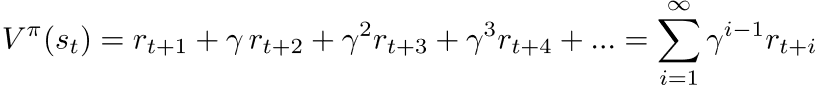

V(s_t) es el valor acumulado que se consigue al seguir la politica pi a partir del estados_t. La idea es tomar acciones que te lleven relativamente pronto al Goal.

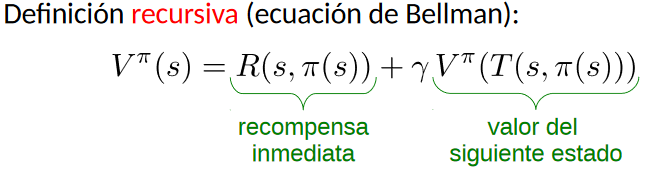

Podemos definir entonces el valor de un estado como la recompensa inmediata mas el valor del siguiente estado. Ahora con esta definicion recursiva, el objetivo es aprender la mejor politica posible dado un problema. Esa politca optima va a tener asociada los valores optimos. Queremos aprender los valores optimos, V\*. Despues en funcion de eso vamos a poder elegir una politica.

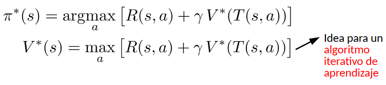

Algoritmo 1: Value Iteration

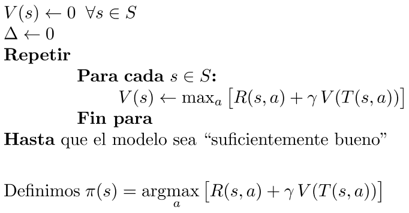

Value iteration requiere conocer el modelo: S, A, R y T. Definimos politicas cuando tenemos todo el mapa conocido. Es un algoritmo ¨model-based¨ porque necesita conocer todo el modelo. Esto en la mayoría de los casos no tiene sentido. Si pongo un robotito en la nada, no sabe los estados, ni las transiciones, ni las recompensas.
Necesitamos un metodo que no necesite conocer todo el modelo. Q-learning.

El objetivo como dijimos es aprender la funcion de valor optima. La formulacion que hicimos antes tiene cosas que dependen mucho de R, V, S. Vamos a tratar de independizarnos de calcular el V\* directamente para tener la politica mejor y vamos a definir lo siguiente.

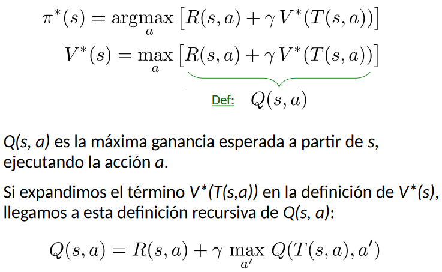

A lo que estamos maximizando lo llamamos Q(s,a). Eso dicho en español es la maxima ganancia esperada a partir de un estado ejecutando la accion a. Para poder hacer esta cuentita necesitamos conocer a R de antemano. Necesito saber si estoy parado aca, quiero evaluar la posibilidad de hacer una accion, quiero ver cuanto reward me da. Eso es el conocimiento del modelo. Saber a donde te llevaria, cuanto te garparian, por cada accion. Ademas se el conjunto de estados. Pero ahora queremos saber casi nada del modelo.

Con esto lo que logre es simplemente escribir a Q(s,a) independizandome del modelo. El gran problema de este metodo es la convergencia.

Lo que esta pasando es que para saber cual es el valor de una accion, ejecuto la accion y me fijo cual es el reward y despues maximizo sobre los Qs del nuevo estado.

Para contextualizarlo, el robotito toma una accion y le llega una recompensa. El en el estado en el que esta parado sabe que acciones puede tomar pero no sabe que recompensas le va a dar cada accion. Si lo supiera entonces conocería R.

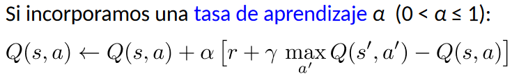

Las politicas pueden ser elegir el mejor Q que tenga, la accion mejor que tenga segun el modelo actual, y otra podria ser a veces elegir al azar, a veces la de mejor ganancia, etc. Hay diferentes formas de elegir.
El gama es cuanto se penalizan las ganancias que vienen despues y cuanto se priorizan las ganancias inmediatas con respecto a las que vienen despues. Las ganancias inmediatas las vamos a usar de una, las que vienen despues las podemos ponderar con 0.9.

Alfa es cuan rapido aprendemos. Este es el valor nuevo de Q(s,a). Si la tasa de aprendizaje es 0 no aprendo nunca nada. Con alfa 1 aprendemos demasiado rapido, no confiamos en la experiencia. Nos quedamos solo con lo que vimos recien, no confiamos en el pasado. QL no requiere conocer el modelo (model-free).

Algoritmo 2: Q-Learning

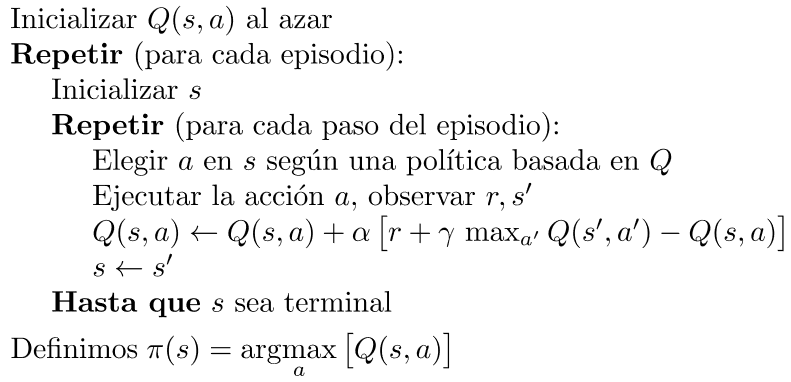

Dilema exploracion-explotacion: cuando explorar mejores opciones, cuando explotar lo que ya sabemos. K-armed bandits, tenemos k maquinas tragamonedas y una cantidad de fichas a jugar, tenemos que estimar las probabilidades de cada una entonces vamos explorando y jugamos 10 fichas en una, 10 fichas en otra y voy armandome una tablita de probabilidad de ganar en cada maquina para tratar de encontrar la que mas ganancia me da.
Veamos algunas estrategias para elegir las maquinas:
Estrategia epsilon-greedy: con probabilidad epsilon vamos a elegir al azar. Por ejemplo con 10% vamos a decir que el 10% de las veces elijo las maquinas al azar y el 90% de las veces elijo la mejor maquina conocida hasta el momento.

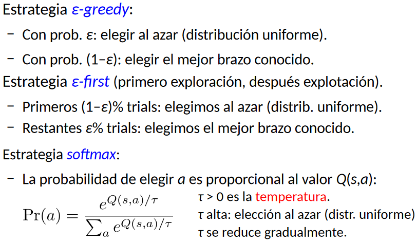
