# Series temporales

## Introduccion

Una serie temporal es una serie de puntos indexados ordenados en el tiempo. Se considera que entre una muestra y la otra siempre hay el mismo espacio.

**Random variation**

Toda colección de datos tomada en el tiempo tiene ruido. Es un error de medición aleatorio, puede ser que el sensor dependiendo de la temperatura cambie su comportamiento, etc. Cuando nos llegan estos datos, llegan sucios.

Hay técnicas para suavizar estas curvas que tienen ruido. Compensar el ruido que tuve en un momento dado con el ruido que tuve un poquito antes suponiendo que como es aleatorio se compensa uno con el otro.

Métodos de reducción de ruido: **“smoothing” (alisamiento)**

- **Alisamiento por medias**
- **Alisamiento exponencial**

El tema que si hacemos por media, puede ser que nuestra curva tenga una pendiente. Entonces calcular la media sobre todos los datos no sirve, hagamosla solo en un entornito chiquito, agarremos 3 anteriores y calculamos la media. Entonces de esta manera puedo alisar tendencias. Esto es el famoso **moving average**. Cuantos puntos agarro? Existen tantos moving average como decisiones tomemos. Cada uno tiene su teoría de cual es el mejor y algunos son muy muy estándar. Lo que se suele usar es que el peso de los puntos anteriores que uno toma decrece exponencialmente (**Exponentially Weighted Moving Average**)

Ahora bien, cómo hacemos para comparar si nuestra estimación es buena? Lo que podemos hacer es calcular el error, es decir, la resta entre la estimación y el valor real. En la práctica lo que se hace es el error al cuadrado.
Ahora bien, podemos hacer la suma de todos estos errores al cuadrado y tener en un numerito, que tan bueno es nuestro modelo. Es cierto esto? Realmente no, veamos el principal inconveniente de usar esta métrica.

Notemos que los errores al cuadrado siempre son positivos, entonces la suma es estrictamente positiva. Si nosotros tenemos una serie aproximada por un modelo lineal con 20 puntos y otra con 40 puntos, que me indica el SSE (suma de errores al cuadrado) en cada una? Notar que a mas puntos, voy a estar sumando más términos en mi SSE.

Tenemos que pensar otra cosa. Podemos calcular por ejemplo la media. Cual es el promedio de los errores cuadráticos (MSE).

Vamos primero con una definición. Serie estacionaria:

Se dice que una serie de tiempo es estacionaria cuando su distribución y sus parámetros no varían con el tiempo. En términos más concretos, la media y la varianza de una serie estacionaria no cambian con el tiempo, y tampoco siguen una tendencia.

Si lo ilustramos con las siguientes imágenes, lo podrás ver de una forma mucho más clara:

## FALTA UNA IMAGEN ACA!! VER DIAPOS DE DATOS TAMBIEN!!

Algo que me gustaría decidir es si una serie es estacionaria o no. Un test de hipótesis para evaluar esto puede ser el **Test de Dickley-Fuller**. Supone que hay una tendencia (es decir, que no es estacionaria), y quiere rechazar esto. Es muy poco probable que esa serie venga de una distribución de probabilidad que tenga tendencia (si el p-valor es muy chico).

**Goodness of fit**: cuan bueno es el fiteo de mi modelo. Un primer approach es medir el promedio de los errores cuadráticos.

Es bueno elegir el modelo que menor MSE me de en los datos nuevos? A primera vista si. Pero qué pasa si le ponemos muchos parámetros? Es decir, que nuestra regresión lineal tenga varios beta a estimar? Por ejemplo, usar un polinomio de grado alto. Vamos a tener error 0 basicamente, y quizá (seguramente) esto no generaliza nada! Por eso es de suma importancia separar un set para entrenar nuestro regresor, y otra para testear.

Notar que tenemos un intervalo de confianza entorno a los Beta que nos dice en qué entorno tenemos 95% de probabilidad de encontrar a esos Beta. Esto es debido a que tenemos un error en nuestras mediciones, y los Beta que calculemos para una muestra luego en otra muestra pueden ser distintos! Si nuestro intervalo es pequeño, entonces van a ser parecidos. Sería muy distinto el Beta si replico muchas veces este experimento con distintas mediciones? Esto nos dice el intervalo de confianza. Notar que definimos que el error de medicion es normal para poder calcular los intervalos de confianza.

## Tendencias lineales:

### Regresión Lineal Simple

Consiste en predecir una respuesta cuantitativa Y en base a una única variable predictora X.

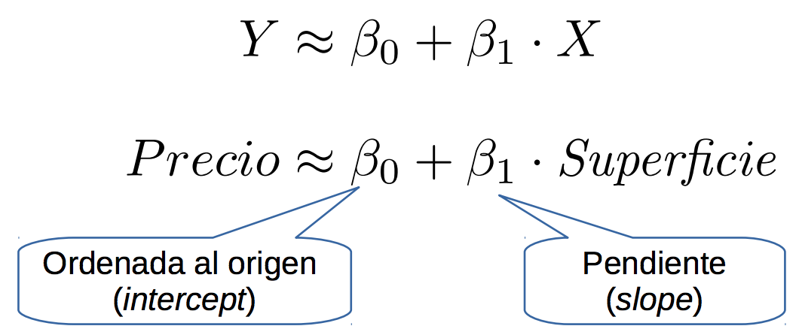

Vamos a estimar $B*{0}$ y $B*{1}$. Una vez hecho esto nos queda la siguiente formula:

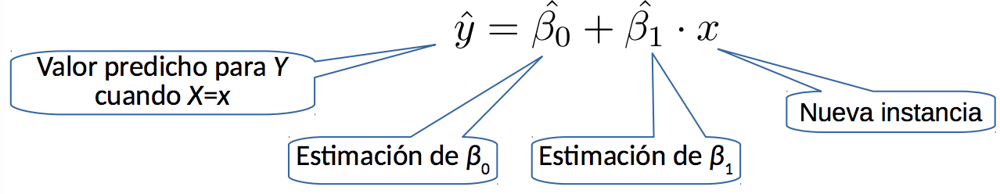

Para encontrar dichas estimaciones vamos a definir lo que es el residuo o error de prediccion:

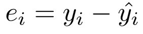
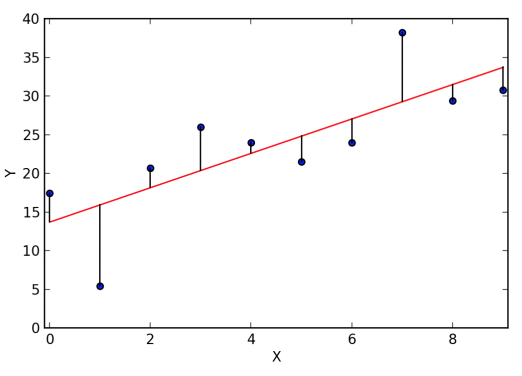

Ahora definimos el RSS (Residual sum of squares):

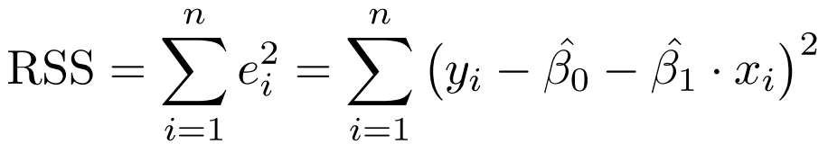

Los residuos se elevan al cuadrado para sacar el signo y para que RSS sea diferenciable
Para estimar los coeficientes, buscamos minimizar RSS. Para esto derivamos RSS respecto de $B*{0}$ y $B*{1}$. Notar que no es robusto ante outliers, ya que RSS penaliza los residuos grandes. Es decir, si nos movemos entre valores cercanos al 0 y de golpe un error de medicion nos brinda una instancia con valor 1 millon, esto nos va a penalizar fuertemente.

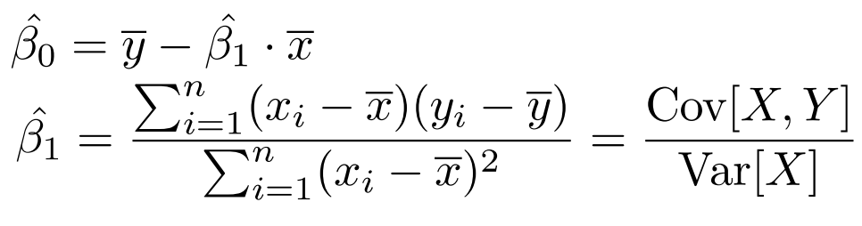

El intercept es el $B*{0}$ y el $B*{1}$ es la pendiente o el coeficiente asociado a la variable superficie. Estamos tratando de evaluar la bondad de dos coeficientes. Para eso se usa el **Standard Error** que me da un valor, ese valor en terminos absolutos no me va a decir demasiado, hay que mirarlos con algo mas. Me da el intervalo de confianza (Es util para estimar intervalos de confianza de las predicciones). El standard error es el punto de partida que me lleva a la columna del p-value. Que es esto? Hacemos experimentos y necesitamos una nocion de cuan bueno es el resultado obtenido. Calculamos primero un **T-Test (test de student)**, es un test estadistico que me permite saber cual es la probabilidad que esa estimacion sea distinta de un numero. El p-valor es el resultado del T-Test. Si es bajo (por ejemplo menor a 0.01) tenemos buenas chances de que el $B*{i}$ correspondiente sea significativo. Es improbable que el valor que nos da de $B*{i}$ sea consecuencia del azar. Es decir, observamos los datos, ajustamos un modelo, tenemos los predictores para $B*{i}$, calculo el standard error, calculo el T-Test y veo que me da como p-valor. Si el p-valor de $B*{i}$ me da bajo quiere decir que tengo buenas chances de que no sea consecuencia del azar, es decir que tuve suerte y que los datos me vinieron de tal manera que si agarro un nuevo set de datos me da otra cosa totalmente diferente. Si yo replico esto con una nueva muestra dentro de la misma poblacion es muy probable que caiga en un valor parecido. El p-valor esta asociado a una nocion de cuan significativos son los resultados y esa nocion es variable cuando definimos que seria un p-valor bajo. Si te da un p-valor alto quiere decir que no le des bola al $B\_{i}$. Por como son los datos, tenes evidencia que si corres de nuevo el experimento, te va a dar otra cosa. Es demasiado amplio el intervalo de confianza que surge. El p-valor nos dice cuán seguro que ese Beta que te devolví sea realmente un número distinto de 0. El T-test es parametrico, tomamos como condicion que el termino del error es una normal (0, algo) con lo que los residuos estan distribuidos normalmente.

Ahora pasamos a que me diga el accuracy, o el F-measure. Para eso se usa la metrica $R^{2}$. Por un lado tenemos la RSS que es la sumatoria de los residuos al cuadrado. Esto me da una nocion de cuanto le pifio el modelo, es lo que queremos minimizar para que el modelo sea lo mas justo, exacto posible. Es una metrica que no es muy util. Es un valor absoluto que depende de los datos que observamos. Queremos algo mas manejable, algo entre 0 y 1 seria buenisimo. Si te da 1 es 100% por ejemplo. Eso es lo que captura $R^{2}$. **Es la variabilidad no explicada por el modelo**. Todo lo que se le escapa al modelo. Si vale 0 es cuando el modelo explica poco de la variabilidad de los datos. Si vale 1 es cuando el modelo explica mucho de la variabilidad de los datos.

Ahora definimos el TSS que es muy parecido. Es la distancia de cada uno de las instancias a lo largo de la dimension i a la media al cuadrado. Es la variabilidad total de los datos. Para todos los datos, es como que pongo aca la media y tome eso como mi modelo base contra el cual comparar. Veo como se comporta la regresion lineal que acabo de ajustar comparado con ese modelo. Es como una varianza sin dividir por el N, sin normalizar. Definimos $R^{2}$. Es cuanto mejore al usar un modelo de regresion lineal. Aca use un modelo bien tonto, aca un modelo mejor al tonto y la diferencia va a ser cuanto mejore. Eso lo normalizo y me da un numero entre 0 y 1. Ojo que puede dar menor que 0! No puede dar mayor que uno. Es 0 cuando el error que genera la recta horizontal es igual al error que genera nuestro modelo. Puede dar negativo tanto como yo quiera. Esta metrica la podemos usar para hacer cross-validation, para entrenar, para elegir atributos, etc.

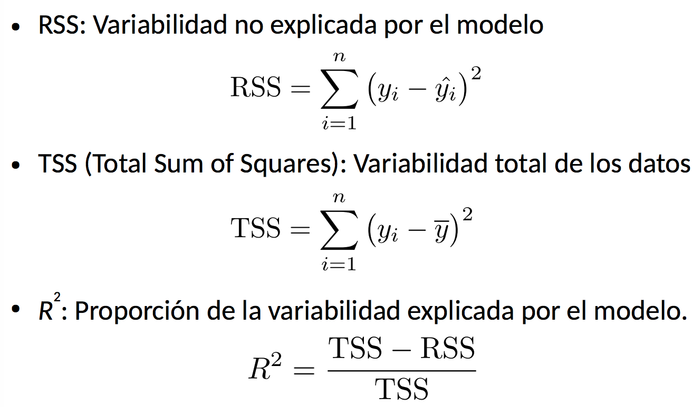

### Regresión Lineal Simple

Consiste en predecir una respuesta cuantitativa Y en base a una única variable predictora X.
Vamos a estimar $B*{0}$ y $B*{1}$. Una vez hecho esto nos queda la siguiente formula:

## ACA FALTA ALGO!!

Para encontrar dichas estimaciones vamos a definir lo que es el residuo o error de prediccion:

## CREO QUE TODO ESTO ESTA REPETIDO

**RSS (Residual sum of squares):**

Los residuos se elevan al cuadrado para sacar el signo y para que RSS sea diferenciable. Para estimar los coeficientes, buscamos minimizar RSS. Para esto derivamos RSS respecto de $B*{0}$ y $B*{1}$. Notar que no es robusto ante outliers, ya que RSS penaliza los residuos grandes.

El intercept es el $B*{0}$ y $B*{1}$ es la pendiente o el coeficiente asociado a la variable superficie. Estamos tratando de evaluar la bondad de dos coeficientes. Para eso se usa el Standard Error que me da un valor, ese valor en terminos absolutos no me va a decir demasiado, hay que mirarlos con algo mas. Me da el intervalo de confianza (Es util para estimar intervalos de confianza de las predicciones). El standard error es el punto de partida que me lleva a la columna del p-value. Que es esto? Hacemos experimentos y necesitamos una nocion de cuan bueno es el resultado obtenido. Calculamos primero un T-Test (test de student), es un test estadistico que me permite saber cual es la probabilidad que esa estimacion sea distinta de un numero. El p-valor es el resultado del T-Test. Si es bajo (por ejemplo menor a 0.01) tenemos buenas chances de que el B_i correspondiente sea significativo. Es improbable que el valor que nos da de B_i sea consecuencia del azar. Es decir, observamos los datos, ajustamos un modelo, tenemos los predictores para B_i, calculo el standar error, calculo el T-Test y veo que me da como p-valor. Si el p-valor de B_1 me da bajo quiere decir que tengo buenas chances de que no sea consecuencia del azar, es decir que tuve suerte y que los datos me vinieron de tal manera que si agarro un nuevo set de datos me da otra cosa totalmente diferente. Si yo replico esto con una nueva muestra dentro de la misma poblacion es muy probable que caiga en un valor parecido. El p-valor esta asociado a una nocion de cuan significativos son los resultados y esa nocion es variable cuando definimos que seria un p-valor bajo. Si te da un p-valor alto quiere decir que no le des bola al B_i. Por como son los datos, tenes evidencia que si corres de nuevo el experimento, te va a dar otra cosa. Es demasiado amplio el intervalo de confianza que surge. El T-test es parametrico, tomamos como condicion que el termino del error es una normal (0, algo) con lo que los residuos estan distribuidos normalmente.

Ahora pasamos a que me diga el accuracy, o el F-measure. Para eso se usa la metrica R^2 (r cuadrado). Por un lado tenemos la RSS que es la sumatoria de los residuos al cuadrado. Esto me da una nocion de cuanto le pifio el modelo, es lo que queremos minimizar para que el modelo sea lo mas justo, exacto posible. Es una metrica que no es muy util. Es un valor absoluto que depende de los datos que observamos. Queremos algo mas manejable, algo entre 0 y 1 seria buenisimo. Si te da 1 es 100% por ejemplo. Eso es el R cuadrado. Es la variabilidad no explicada por el modelo. Todo lo que se le escapa al modelo. Si vale 0 es cuando el modelo explica poco de la variabilidad de los datos. Si vale 1 es cuando el modelo explica mucho de la variabilidad de los datos. Ahora definimos el TSS que es muy parecido. Es la distancia de cada uno de las instancias a lo largo de la dimension i a la media al cuadrado. Es la variabilidad total de los datos. Para todos los datos, es como que pongo aca la media y tome eso como mi modelo base contra el cual comparar. Veo como se comporta la regresion lineal que acabo de ajustar comparado con ese modelo. Es como una varianza sin dividir por el N, sin normalizar. Definimos R cuadrado. Es cuanto mejore al usar un modelo de regresion lineal. Aca use un modelo bien estupido, aca un modelo mejor al estupido y la diferencia va a ser cuanto mejore. Eso lo normalizo y me da un numero entre 0 y 1. Puede dar menor que 0 O_O. No puede dar mayor que uno. Es 0 cuando el error que genera la recta horizontal pava es igual al error que genera nuestro modelo. Puede dar negativo tanto como yo quiera, pensarlo. Esta metrica la podemos usar para hacer cross-validation, para entrenar, para elegir atributos, etc.

## CREO QUE TODO ESTO ESTA REPETIDO

### Regresion lineal multiple

Ahora vamos a permitir muchas variables. Puede pasar que por ejemplo defina el precio de una propiedad por distintas variables como por ejemplo, la cantidad de colectivos que pasan por ahi, la cantidad de metros cuadrados, la cantidad de pisos, la distancia al subte mas cercano y alguna de estas me de no significativa. Es decir, un p-valor alto. Entonces la puedo eliminar. Me advierte que no le de bola a la variable, no esta aportando nada en este modelo.
Notar que cuando analizamos la correlacion de dos variables no vemos causalidad!. Podemos predecir en base a un estimador, que el otro se va a comportar igual. Es todo lo que puedo decir. No lleva una cosa a la otra. Si estados unidos gasta mas en ciencia, no va a haber mas suicidios, no hay causalidad. De ninguna manera estamos haciendo un experimento de que A implica B.

### Regresion de polinomios (no lineal)

Que pasa cuando los datos no se comportan como una recta? Hacemos regresion de polinomios. La intuicion detras de todo esto es que cuando los $B*{i}$ son 0, cuando vamos poniendo en 0 coeficientes hacemos un modelo cada vez mas simple. Un modelo con mas coeficientes con valores distintos a 0 son mas complejos. Ademas esta la nocion de que cuando son mas chiquitos, un monton de $B*{i}$ con valores muy chicos, me va a dar un modelo mas simple. La regla del pulgar nos dice que valores altos de $B*{i}$ llevan al sobreajuste. Entonces hagamos algo para que sean lo mas bajo posibles. Puede llevarnos a construir mejores modelos. Para esto usamos regularizacion. Lo que hace es penalizar los valores altos de $B*{i}$. En cuadrados minimos veniamos minimizando el error cuadratico medio. Lo que vamos a agregar es un termino mas que penalice los valores altos.

Lambda y q son hiperparametros del modelo. Vamos a minimizar toda la ecuacion. Estamos minimizando los residuos (suma de residuos al cuadrado) y le agregamos el termino de la suma de los cuadrados de los coeficientes (cuando q=2 la técnica se conoce como ¨Ridge Regression¨). A la hora de ajustar todo esto vamos a elegir los valores que minimizan los dos al mismo tiempo. Por un lado ajustan el modelo a los datos y por otro lado suelen mantener $B*{i}$ con valores bajitos. El lambda le da un mayor o menor relevancia a las penalizaciones. Para que esto funcione bien hay que tener estandarizadas los valores de las variables de los diferentes ies. Las distintas variables del modelo. Estandarizar es a un valor X restarle la media y dividirlo por el desvio estandar. Lo llevamos a una Normal(0, 1). A todas las variables escalarlas para que sean comparables. Sino lo que pasa es que los valores de los coeficientes dependen directamente de los numeros de la componente correspondiente, entonces queremos poder regularizar bien. No podemos tener peras y manzanas. Todas las variables dentro de la misma escala. Sino no va a hacer nada. Si queremos poder penalizar algunos coeficientes y priorizar otros, queremos todas las magnitudes de cada componente sean comparables (esto lo hace la regularizacion). Todas las $X*{i}$ van a ser comparables ahora.

Todo esto, la regresion lineal y la regresion por polinomios, son casos particulares de algo mas general que es el modelo de la generalizacion de regresion lineal (Regresion de funciones base). Usamos una funcion $\phi$ que toma todos los atributos que tengo en mi set de datos y puede hacer cualquier tipo de funcion sobre estos. $\phi$ es la función base.

Cada funcion $\phi$ es una funcion definida sobre todas las variables de mi problema. Y todo esto no es otra cosa que transformar el espacio de atributos. Puedo hacer reduccion de atributos teniendo pocos $\phi$'s, puedo hacer PCA aca adentro, puedo hacer de todo.

Porque todo esto se llama como regresion lineal? Porque los coeficientes $B*{1}$, $B*{2}$ y $B*{n}$ estan todos a la 1, son todos lineales. Lo demas son todos atributos. Se puede resolver facilmente con cuadrados minimos. Renombro a cada $\phi$ como $X*{1}$, $X*{2}$, …, $X*{n}$.

## Regresion logistica

La regresión lineal no es buena para modelar la probabilidad de ocurrencia de un evento.

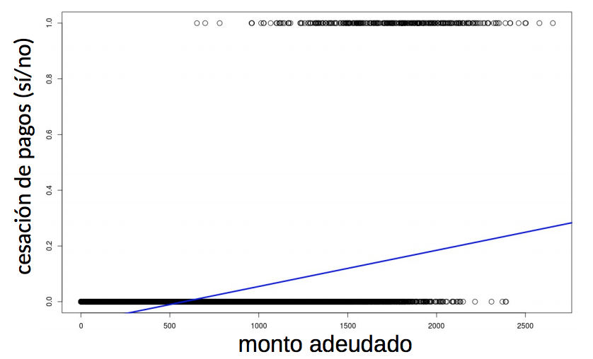

Si me voy mas para la izquierda me da valores negativos y si te vas mas para la derecha te da mayor que uno! No me esta dando una probabilidad. Entonces usamos una funcion logistica.

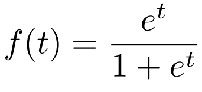

Vamos a tratar de ajustar la funcion logistica a mis datos. Como la RSS se forma de manera similar, podemos usar tambien la tecnica de minimos cuadrados para fitear el modelo. Es una tecnica muy util para clasificacion. Me da la probabilidad de pertenencia a una clase. Si pongo un umbral en 0.5 lo discretizamos y digo de aca para aca son falsos y de aca para aca verdaderos, entonces es un problema de clasificacion.

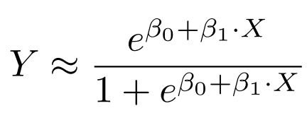
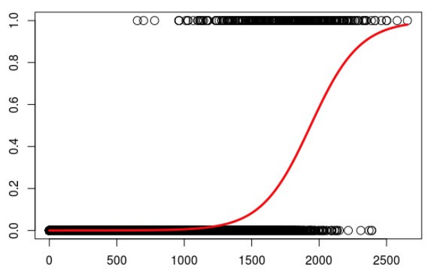

## Regresion logistica multiple
